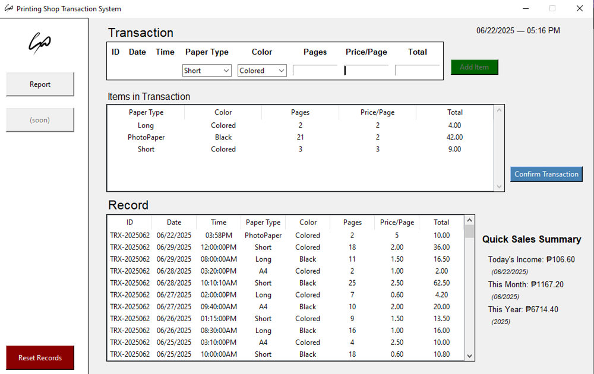
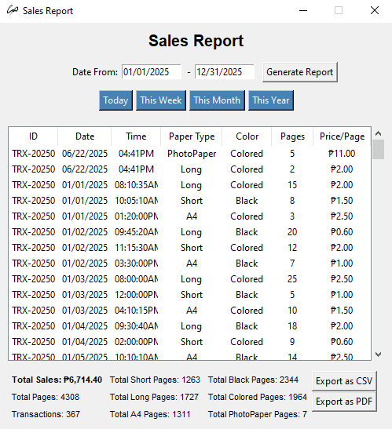

# Printing Shop Transaction System

## Overview

This is a simple, standalone desktop application developed using Python and Tkinter for managing printing shop transactions. It allows users to record printing jobs, view a history of all transactions, and generate basic sales reports for different periods. The system is designed for ease of use and portability, storing all data in a local CSV file.

  

## Features

* **Intuitive Transaction Entry:**
    * Input fields for Paper Type (Short, Long, A4, PhotoPaper), Color (Black, Colored), Pages, Price/Page, and Total.
    * Automatic calculation/suggestion of "Total" price based on Pages and Price/Page.
    * Add multiple items to a temporary "Items in Transaction" list before confirming.
    * Edit and delete individual items from the temporary list via double-click or right-click context menu.
* **Transaction Management:**
    * Confirm transactions to move items from the temporary list to the main "Record" table.
    * Auto-generates unique Transaction IDs for each confirmed sale.
    * Save all confirmed records to a `records.csv` file for persistence.
    * Delete past transactions from the "Record" table via right-click context menu.
* **Quick Sales Summary (Main Screen):**
    * Displays real-time summaries for Today's Income, This Month's Income, and This Year's Income.
* **Detailed Sales Report:**
    * Accessible via a dedicated "Report" button.
    * Allows filtering transactions by a custom date range.
    * Provides aggregate statistics including Total Sales, Total Pages, Total Transactions, and specific page counts by Paper Type (Short, Long, A4, PhotoPaper) and Color (Black, Colored).
    * Ability to export the displayed report data as a CSV file.
* **Portable Design:**
    * Can be packaged into a standalone application (using PyInstaller) that runs without needing Python installed on the user's machine.
    * Data (`records.csv`) persists directly within the application's folder structure when distributed, making it easy to move.
* **Customizable Window Icon & Sidebar Logo:**
    * Supports custom application icon for the window title bar.
    * Displays a custom logo/image in the sidebar.
* **Reset Functionality:**
    * A "Reset Records" button at the bottom-left allows clearing all saved transaction data for a fresh start (with confirmation).

## Technologies Used

* **Python 3.x:** The core programming language.
* **Tkinter:** Python's standard GUI (Graphical User Interface) toolkit.
* **Pillow (PIL Fork):** For handling and displaying images (logo, window icon).
* **CSV Module:** For reading and writing transaction data to `records.csv`.
* **PyInstaller:** (Used for packaging) To create standalone executable versions of the application.

## Getting Started

### Prerequisites

* Python 3.x installed on your system.
* `pip` (Python's package installer), usually comes with Python.

### Setup (for Development)

1.  **Clone the Repository:**
    ```bash
    git clone [https://github.com/Mejez6603/Printing-POS-Python.git](https://github.com/Mejez6603/Printing-POS-Python.git)
    cd Printing-POS-Python
    ```
    (Note: Replace `Printing-POS-Python` if your repository name is different)

2.  **Install Dependencies:**
    ```bash
    pip install Pillow
    ```

3.  **Prepare Data/Assets:**
    * Ensure you have a `database` folder in the root directory.
    * Inside `database`, an empty `records.csv` file will be created on first run, or you can paste provided sample data.
    * Place your `logo.png` and `your_app_icon.png` (or whatever you named them) in the root directory alongside `main.py`.

### Running the Application (Development Mode)

```bash
python main.py
````

## Usage

1.  **Start a Transaction:** Fill in the item details (Paper Type, Color, Pages, Price/Page). The "Total" will auto-calculate.
2.  **Add Item:** Click "Add Item" to add the current item to the "Items in Transaction" list. You can add multiple items.
3.  **Edit/Delete Item (Before Confirming):**
      * Double-click an item in the "Items in Transaction" table to populate its details back into the input fields for editing.
      * Right-click an item in the "Items in Transaction" table for "Edit Item" or "Delete Item" options.
4.  **Confirm Transaction:** Once all items for a sale are added, click "Confirm Transaction". This saves the items to the main "Record" table and `records.csv`.
5.  **View Records:** The "Record" table on the main screen displays all past transactions.
6.  **Generate Sales Reports:** Click the "Report" button in the sidebar to open a detailed sales report window. You can select date ranges and export.
7.  **Reset Records:** Click the "Reset Records" button in the sidebar (bottom-left) to clear all saved data (requires confirmation).

## Project Structure

```
Printing-System-Python/
├── main.py                   # Main application entry point and GUI layout
├── transaction.py            # Handles CSV saving/loading and input validation
├── sales_report.py           # Logic for generating sales statistics from CSV
├── sales_report_window.py    # GUI for the detailed Sales Report window
├── database/                 # Directory for data files
│   └── records.csv           # Stores all transaction records
├── reports/                  # Directory for exported CSV reports
├── logo.png                  # Sidebar logo image
└── your_app_icon.png         # Application window icon (rename as appropriate)
├── .gitignore                # Specifies files/folders to ignore in Git
└── README.md                 # This file!
```

## Packaging for Distribution (Standalone Executable)

To create a portable executable (e.g., `main.exe` on Windows) that can be run on computers without Python installed:

1.  **Install PyInstaller:** `pip install pyinstaller`
2.  **Navigate to project root:** `cd Printing-System-Python`
3.  **Run PyInstaller command:**
    ```bash
    pyinstaller --noconsole --add-data "database;database" --add-data "logo.png;." --add-data "your_app_icon.png;." "main.py"
    ```
    (Remember to replace `your_app_icon.png` with your actual icon filename.)
4.  The standalone application will be found in the `dist/main` folder. Copy this entire folder for distribution.

## Future Enhancements

  * **Embedded Sales Report View:** Implement the option to display the sales report directly within the main window instead of a new Toplevel window (already partially prototyped).
  * **PDF Export for Reports:** Add functionality to export sales reports as PDF files.
  * **Advanced Reporting:** More detailed filtering options, graphical charts, or custom report generation tools.
  * **Product/Service Catalog:** Implement a database (e.g., SQLite) to manage predefined paper types, ink types, and pricing rules.
  * **User Management:** Add login functionality for different staff members with roles.
  * **Basic Inventory Tracking:** Monitor stock levels of paper and ink.

## Changelog

### v1.0.0 - Initial Release (2025-06-22)

* **Core Functionality:**
    * Implemented full transaction input and management.
    * Added dynamic "Add Item" to temporary list.
    * Enabled confirmation of transactions to main record table.
    * Persistent data storage in `database/records.csv`.
* **Reporting:**
    * Quick sales summary on the main transaction screen.
    * Detailed Sales Report window with date filtering.
    * Aggregated metrics (Total Sales, Total Pages, Total Transactions).
    * Breakdown of pages by Paper Type (Short, Long, A4, PhotoPaper) and Color (Black, Colored).
    * Export Sales Report to CSV.
* **User Interface & Experience:**
    * Clean and intuitive Tkinter GUI.
    * Automatic "Total" calculation in transaction input.
    * Item editing and deletion from pending transaction list.
    * Application window icon and sidebar logo integration.
* **Maintenance & Portability:**
    * Configured project for PyInstaller packaging (`--onedir` for portable folder distribution).
    * "Reset Records" functionality to clear all stored data.
    * Robust path handling for data files in packaged app.

---
## System Requirements

### For Portable Standalone Application

* **Operating System:** Windows 7 or newer (Windows 10/11 recommended).
    * (Note: Linux/macOS executables can be built with appropriate GitHub Actions runners, but are not bundled in the default Windows build.)
* **Hardware:** A modern computer with sufficient RAM (e.g., 2GB+ RAM, 1GHz+ processor) for general desktop application usage.
* **Disk Space:** Approximately [e.g., 100MB - 300MB] for the extracted application folder, plus space for your `records.csv` data (which will grow over time).

### For Development Setup (Running from Source Code)

* **Operating System:** Windows, macOS, or Linux.
* **Python:** Python 3.6 or newer (Python 3.9+ recommended).
* **Pip:** Python's package installer.
* **Required Python Libraries:**
    * `Pillow`
    * `tkinter` (usually built-in with Python)
    * (Optionally `pyinstaller` if you plan to build executables yourself)

## Troubleshooting

### Common Issues and Solutions

* **"ModuleNotFoundError: No module named 'PIL'"** (When running from source)
    * **Reason:** The `Pillow` library is not installed.
    * **Solution:** Open your terminal/command prompt and run `pip install Pillow`.
* **Data not refreshing or showing zeros in Sales Reports/Quick Summary (in bundled app)**
    * **Reason:** The application might be having trouble locating `records.csv`. This specific issue was addressed in recent updates.
    * **Solution:** Ensure you are using the latest version of the application code. If you rebuilt with PyInstaller, ensure `sales_report.py` uses the updated pathing `base_dir = os.path.dirname(os.path.abspath(__file__))`.
* **"Add Item" button is disabled.**
    * **Reason:** Not all required input fields (Paper Type, Color, Pages, Price/Page, Total) in the transaction input section are filled.
    * **Solution:** Fill in all the fields. The button will enable automatically.
* **Application launches, but crashes shortly after (in bundled app).**
    * **Reason:** This can be due to various reasons, including missing data files or environmental issues not captured during packaging.
    * **Solution:**
        1.  Ensure you used the `--add-data` flags correctly during PyInstaller packaging for `database`, `logo.png`, and `your_app_icon.png`.
        2.  Try running PyInstaller without `--noconsole` first to see if any errors are printed to the console window that appears.
* **My data disappeared after I moved the portable app folder!**
    * **Reason:** If you moved the *extracted* application folder (e.g., `dist/main/`) to a new location, the `database/records.csv` file inside it moved along with it. If you had saved data, it should still be there.
    * **Solution:** Ensure you're running the `main.exe` from the correct, complete portable application folder that contains your `database` subfolder with your `records.csv`.

## Acknowledgments

* Special thanks to the open-source community for developing Python, Tkinter, Pillow, and PyInstaller.
* Nooby
* Doc
* Firelink
* SBBC PC
* To my dog and cat

## License

This project is licensed under the MIT License - see the [LICENSE](LICENSE) file for details.
